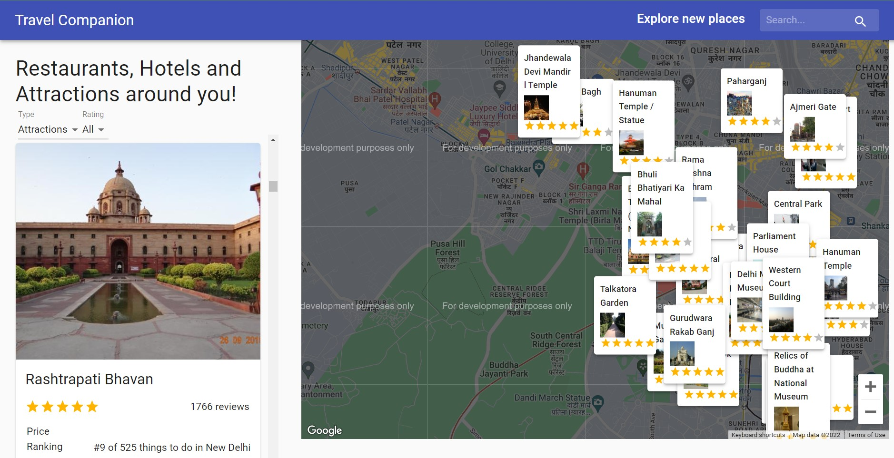

# TRAVEL COMPANION

## INTRODUCTION

This application gives information about Hotels,Restaurants & Attractions based on individual's current location.It also displays the present weather conditions of all the places.

The application uses :

- Geo-location
- Google Map API
- Google places API
- Fetching API data based on location
- Data filtering
- [Open Weather Map API](https://rapidapi.com/community/api/open-weather-map/)
- [Travel Advisor API](https://rapidapi.com/apidojo/api/travel-advisor/)

Setup: run npm i && npm start to start the development server

**NOTE: For some reason Google Places API and Open Weather Map API are down.It will be fixed soon**
